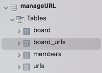
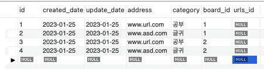
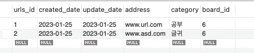
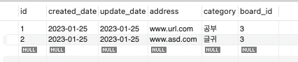

## URL 도메인 구현

### 연관관계 매핑

Board와 Url을 양방향 매핑 관계를 가진다. <br>
굳이 양방향으로 매핑해야 할까? <br>

- Url에 Board_Id 만으로 찾아서 쓰면 되지 않을까?
  - 글에 대한 url들을 매번 조회하는 비용에 비하면 낫지 않을까? 왜냐하면 한번 해놓으면 그때그때 추가하거나 삭제하면 되니깐.

정확히 모르겠다. 우선 양방향 매핑을 해보자. <br>

문제 1) 단순히 @OneToMany와 @ManyToOne만 사용한 경우. <br>

왠 이상한 중간 테이블이 하나 만들어진다.



문제 2) 그럼 조인을 하자! @JoinColmn을 추가 <br>

Board 엔티티

```Java
...

@OneToMany
@JoinColumn
private Set<Url> urls;

...
```

urls_id란 컬럼이 하나 새롭게 만들어진다. (JPA 임의로 만들어버렸다.) <br>



하지만, id를 BaseEntitiy에서 상속받아 사용하는 중이기에 졸지에 id값이 두 개가 된 셈이다. <br>

문제 3) 그럼 URL 엔티티의 id의 이름을 변경할 방법이 없나? <br>

id를 상속받고 있지만, 테이블의 id 이름을 지정하고 싶을 때, @AttributeOverrides를 사용한다고 한다. <br>

```Java
@OneToMany
@JoinColumn(name = "urls_id")
private Set<Url> urls;
```

```Java
@Entity
@Table(name = "urls")
@AttributeOverrides({
@AttributeOverride(name = "id", column = @Column(name="urls_id"))
})
public class Url extends DateEntity{
    // ...
}
```



해결은 되었다! 하지만 뭔가 찝집하다. 또, URL 엔티티 id만 다른 것이 맘에 들지 않는다. <br>

문제 4) mappedBy 속성을 통해 해결할 수 있었다. <br>

Url 엔티티

```Java
@Entity
@Table(name = "urls")
public class Url extends DateEntity{

    @ManyToOne
    Board board;

    @Column
    String address;

    @Column
    String category;

    //...
}
```

Board 엔티티

```Java
...

@OneToMany(mappedBy = "board")
    private Set<Url> urls;

...
```



정리 <br>
위와 같은 문제를 겪어보니 BaseEntity를 통해 Id를 상속하는 것이 좋은 방법인지 의문이 든다. <br>
